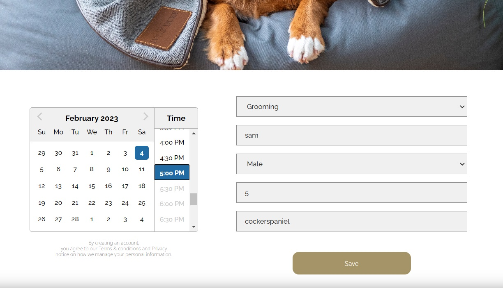

Firstly run `npm init -y`, and `npm i express` then run `npm start` or `nodemon` to get the Server running. 

make a DB with Mongo DB. 
    
    1. create a user/account  then sign in 
    2. create a cluster as a free user and install the extension in vs code 'MongoDB for VScode'. 
    3. then create a database and seed it with the needed users entries by running the files in the following order by pressing the play button in the top right conner of each file
        - 'src/mongoDB_data_entries/1. create_users_database.mongodb'         
        - 'src/mongoDB_data_entries/2. create_bookings_database.mongodb'
        - 'src/mongoDB_data_entries/3. user_entries.mongodb'
  
 Disclaimer: before doing step 4, make sure to uncomment 'user' for each entry and manually copy and paste over the id of the newly created user_id from MongoDB. Once done you will be able to seed and connect the users to bookings. And do so by pressing the play button for the following file.
        - 'src/mongoDB_data_entries/4. booking_entries.mongodb'
    4. then create a .env file in the root of the project and  fill in the ATLAS DB connection string in the .env file, a sample file has been provided.

or alternatively to step 3, run `node seed.js` once your database 'PAWFUL' is created and connected with the 2 needed collections(can use `mongo_data_entries/1. create_users_database.mongodb` then `mongo_data_entries/2.createbookings_database.mongodb`) this will create 2 collections 'users' and 'bookings'. then do and `node seed.js`, in terminal, to seed users collection. Then manually insert the user_id from the ids created in users into `node seed2.js` to creating bookings which relate to your newly created users, as `users[2]._id` didn't work unfortunately. If followed correctly this will create some default entries into our DB's 'users' and 'bookings' collections.

below are documentation and proof of user testing and the API endpoints as well as showing that our deployed application is fully tested.

## Front-End Testing and Deployment

###Booking
--------------

###Create Account
--------------

###Homepage
--------------

###Login
--------------

###Inquiry
--------------

## Back-End Testing

###Login and Register
--------------

###Get Requests
--------------

###Post Requests
--------------

###Update Requests
--------------

###Delete Requests
--------------

